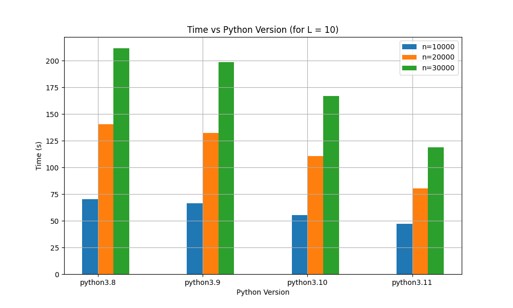
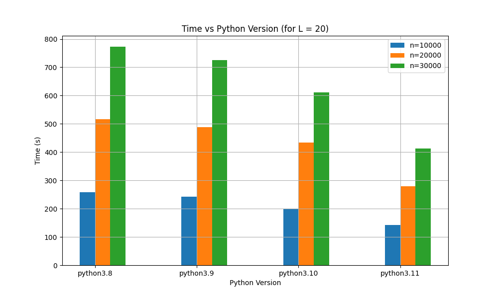
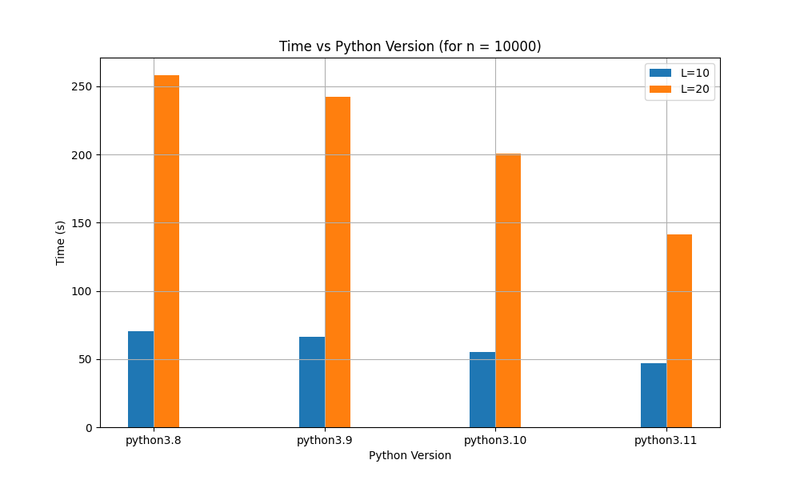
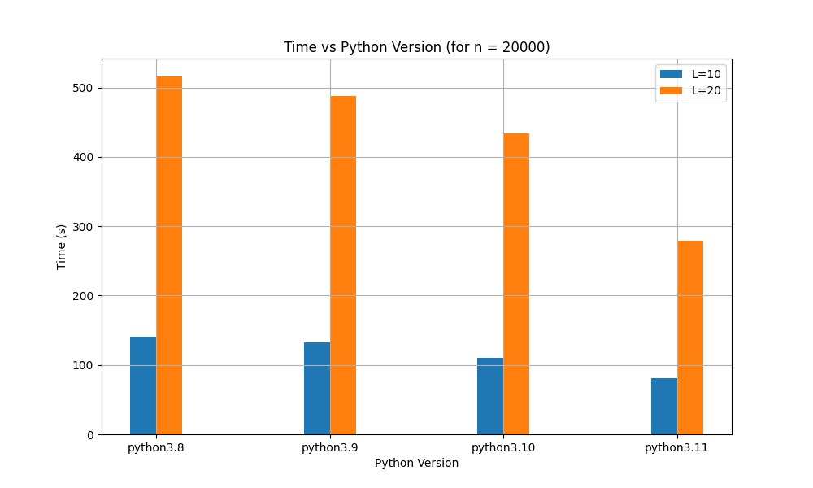
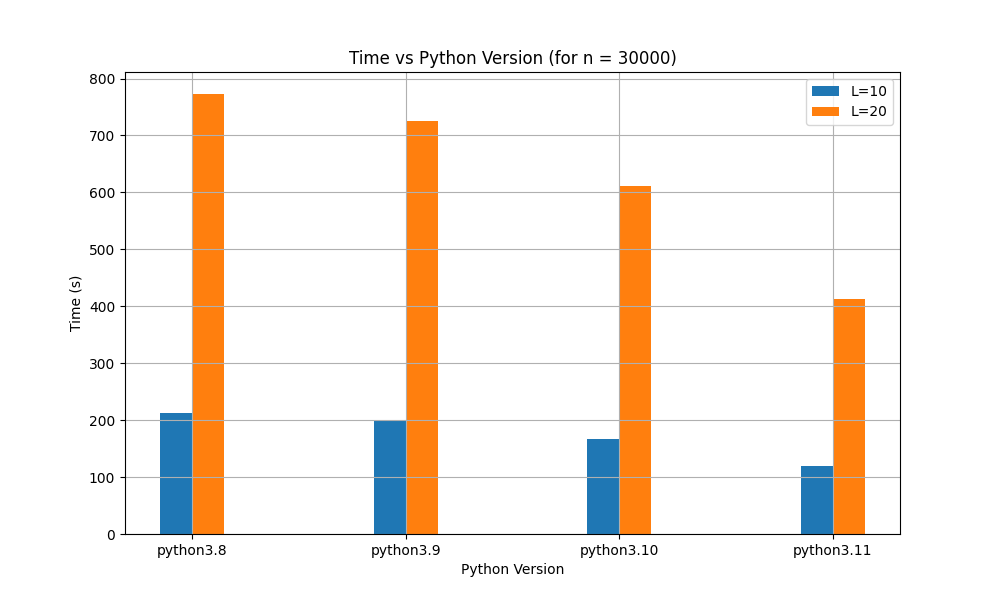

# Ising Model Python Benchmark
Ising model simulation as python Benchmarking test


## About

This repository contains code to perform simulations of the 2-d Ising model, a mathematical model in statistical mechanics. The model consists of discrete variables that represent magnetic dipole moments of atomic spins that can be in one of two states (+1 or -1). The simulations aim to study phase transitions, specifically the phenomenon of spontaneous magnetization. As new python releases are released I will test them vs the previous releases.

## packages

Previously I used `numpy` but this wasn't ideal situation because I introduced a dependency. So I decided to use the standard library `random` and `math` to implement the simulation. 
The old `ising.py` file containts this code. But the standatd implementation is in `ising_model.py` file.


## Results

### Manual executions (Apple Silicon Macs - Standard)

The benchmarks are executed on Macbook pro Apple Silicon M1 version. The python version are installed using `homebrew`

The arguments of the script are L(length of the lattice),  n(number of Monte Carlo cycles).

Also there is a `run_bench.sh` script that runs the benchmark for all the python versions (3.8-3.11) for different `n` and `L` values. 

The results are stored in `results` folder. You can reproduce the results by running the `run_bench.sh` script.

These are the plots that are generated from the results (using `plot_results.py` script). I use the `png` as Github doesn't support embedded `pdf` files in the `README.md`.








### Manual executions (Apple Silicon Macs - Numpy)

The benchmarks are also executed on the same Macbook pro Apple Silicon M1 version. The python version are installed using `homebrew`

The arguments of the script are L(length of the lattice),  n(number of Monte Carlo cycles). 

#### python 3.11

```bash
time python3.11 ising.py 10 10000
Time it took in seconds is = 109.2954261302948
python3.11 ising.py 10 10000  110.82s user 0.79s system 100% cpu 1:51.38 total
```

#### python 3.10 

```bash
time python3.10 ising.py 10 10000
Time it took in seconds is = 123.83638191223145
python3.10 ising.py 10 10000  124.80s user 0.69s system 101% cpu 2:04.06 total
```

#### python 3.9


```bash
time python3.9 ising.py 10 10000
Time it took in seconds is = 123.56476402282715
python3.9 ising.py 10 10000  123.94s user 1.08s system 101% cpu 2:03.67 total
```

#### python 3.8

```bash
time python3.8 ising.py 10 10000
Time it took in seconds is = 135.1741383075714
python3.8 ising.py 10 10000  137.05s user 1.00s system 100% cpu 2:17.24 total
```

#### Other versions 

Python started supporting apple silicon starting from `python3.8` and I try to make things as consistent as possible. Not to mention that `numpy` optimization for different version might be unaccounted difference. 


### Continuous integration 
This repository is using github actions to run the simulation on `ubuntu` instance so that this is not limited to have `3.8` as a minimum version but I keep limited test versions before that to avoid having a long CI run. The results are published on a webpage [here](https://melashri.net/python_bench_ising/). 


## Contributions 

I welcome contributions to improve the code and the efficiency of the simulation. If you would like to contribute, feel free to fork this repository, make your changes, and submit a pull request. Please make sure that your code is clean, well-commented, and does not break the existing functionalities or introduce dependencies. 

